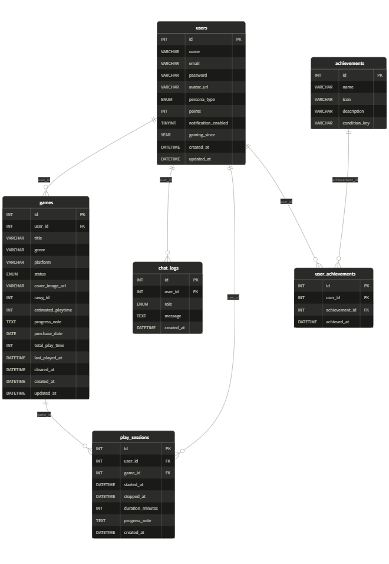

# データベース定義書

## アプリ名

積みゲー・コンシェルジュ

- データベース種別：MySQL 8.0+
- データベース名：`tsumige_db`
- 文字コード：`utf8mb4` / `utf8mb4_unicode_ci`

---

## テーブル一覧

| # | テーブル名 | 役割 |
|---|---|---|
| 1 | `users` | ユーザー情報（認証・プロフィール・設定） |
| 2 | `games` | 積みゲーマイリスト（アプリの中心テーブル） |
| 3 | `chat_logs` | AIコンシェルジュとのチャット履歴 |
| 4 | `play_sessions` | プレイタイマーの記録（開始・停止・メモ） |
| 5 | `achievements` | 実績マスターデータ（積みゲー城タブの実績グリッド） |
| 6 | `user_achievements` | ユーザーごとの実績取得記録 |

---

## テーブル定義

### 1. `users` — ユーザー情報

| カラム名 | 型 | NULL | デフォルト | 制約 | 内容 |
|---|---|:---:|---|---|---|
| `id` | INT | NO | — | PRIMARY KEY, AUTO_INCREMENT | ユーザーID |
| `name` | VARCHAR(100) | NO | — | — | ユーザー名 |
| `email` | VARCHAR(255) | NO | — | UNIQUE | メールアドレス |
| `password` | VARCHAR(255) | NO | — | — | bcryptjs でハッシュ化したパスワード |
| `avatar_url` | VARCHAR(255) | YES | NULL | — | プロフィール画像のパス（例: `/uploads/avatars/user_1.png`） |
| `persona_type` | ENUM | NO | `'butler'` | — | AIペルソナ設定。`butler`=執事 / `gamer`=ゲーマー仲間 / `fairy`=妖精 |
| `points` | INT | NO | `0` | — | 累計ポイント（ゲームクリアごとに加算） |
| `notification_enabled` | TINYINT(1) | NO | `1` | — | 通知設定。`1`=ON / `0`=OFF |
| `gaming_since` | YEAR | YES | NULL | — | ゲームを始めた年。プロフィールの「ゲーマー歴 X年」を `YEAR(NOW()) - gaming_since` で計算 |
| `created_at` | DATETIME | NO | CURRENT_TIMESTAMP | — | 登録日時（「2024年4月登録」の表示に使用） |
| `updated_at` | DATETIME | NO | CURRENT_TIMESTAMP | ON UPDATE CURRENT_TIMESTAMP | 最終更新日時 |

---

### 2. `games` — 積みゲーマイリスト

| カラム名 | 型 | NULL | デフォルト | 制約 | 内容 |
|---|---|:---:|---|---|---|
| `id` | INT | NO | — | PRIMARY KEY, AUTO_INCREMENT | ゲームID |
| `user_id` | INT | NO | — | FOREIGN KEY → `users.id` | 所有ユーザー |
| `title` | VARCHAR(255) | NO | — | — | ゲームタイトル |
| `genre` | VARCHAR(100) | YES | NULL | — | ジャンル（RAWG API から自動取得 または 手動入力） |
| `platform` | VARCHAR(50) | YES | NULL | — | プラットフォーム（Switch / PS5 / PC など） |
| `status` | ENUM | NO | `'未開封'` | — | ステータス。`未開封` / `序盤で放置` / `中断中` / `プレイ中` / `クリア済み` |
| `cover_image_url` | VARCHAR(255) | YES | NULL | — | カバー画像URL（RAWG API 自動取得。未ヒット時はローカルアップロードパス） |
| `rawg_id` | INT | YES | NULL | — | RAWG API のゲームID（手動登録時は NULL） |
| `estimated_playtime` | INT | YES | NULL | — | 推定クリア時間（時間単位）。RAWG API の `playtime` フィールドを保存。「残り約Xh」= `estimated_playtime - (total_play_time / 60)` |
| `progress_note` | TEXT | YES | NULL | — | 進捗メモ（「第3の祠まで終了」など） |
| `purchase_date` | DATE | YES | NULL | — | 購入日 |
| `total_play_time` | INT | NO | `0` | — | 累計プレイ時間（分単位）。`play_sessions.duration_minutes` の合計値。※セッション更新のたびにAPI側で同期すること |
| `last_played_at` | DATETIME | YES | NULL | — | 最終プレイ日時 |
| `cleared_at` | DATETIME | YES | NULL | — | クリア済みにした日時。`status='クリア済み'` にセット時のみ `NOW()` を書き込む。プロフィールの「今月クリア N本」の集計に使用。ステータスを戻した場合は `NULL` にリセット |
| `created_at` | DATETIME | NO | CURRENT_TIMESTAMP | — | 登録日時 |
| `updated_at` | DATETIME | NO | CURRENT_TIMESTAMP | ON UPDATE CURRENT_TIMESTAMP | 最終更新日時 |

---

### 3. `chat_logs` — AIチャット履歴

| カラム名 | 型 | NULL | デフォルト | 制約 | 内容 |
|---|---|:---:|---|---|---|
| `id` | INT | NO | — | PRIMARY KEY, AUTO_INCREMENT | ログID |
| `user_id` | INT | NO | — | FOREIGN KEY → `users.id` | 発言したユーザー |
| `role` | ENUM | NO | — | — | 発言者区分。`user`=ユーザー / `assistant`=AIの返答 |
| `message` | TEXT | NO | — | — | メッセージ本文 |
| `created_at` | DATETIME | NO | CURRENT_TIMESTAMP | — | 送信日時 |

> チャットメッセージは送信後に編集しないため `updated_at` は持たない。

---

### 4. `play_sessions` — プレイセッション記録

| カラム名 | 型 | NULL | デフォルト | 制約 | 内容 |
|---|---|:---:|---|---|---|
| `id` | INT | NO | — | PRIMARY KEY, AUTO_INCREMENT | セッションID |
| `user_id` | INT | NO | — | FOREIGN KEY → `users.id` | プレイしたユーザー |
| `game_id` | INT | NO | — | FOREIGN KEY → `games.id` | プレイしたゲーム |
| `started_at` | DATETIME | NO | — | — | 「今すぐプレイ」ボタンを押した日時。DBに保存することでブラウザを閉じても `現在時刻 - started_at` で経過時間を再計算できる |
| `stopped_at` | DATETIME | YES | NULL | — | ストップボタンを押した日時。プレイ中は `NULL` |
| `duration_minutes` | INT | YES | NULL | — | プレイ時間（分単位）。`stopped_at - started_at` を停止時に自動計算して保存 |
| `progress_note` | TEXT | YES | NULL | — | 「どこまでやった？」入力欄の内容 |
| `created_at` | DATETIME | NO | CURRENT_TIMESTAMP | — | レコード作成日時（`started_at` と概ね同じだが、`started_at` はUI操作の時刻、`created_at` はDBへの書き込み時刻） |

---

### 5. `achievements` — 実績マスターデータ

| カラム名 | 型 | NULL | デフォルト | 制約 | 内容 |
|---|---|:---:|---|---|---|
| `id` | INT | NO | — | PRIMARY KEY, AUTO_INCREMENT | 実績ID |
| `name` | VARCHAR(100) | NO | — | — | 実績名（例: 「初クリア」「5本クリア」） |
| `icon` | VARCHAR(10) | NO | — | — | アイコン絵文字（例: ⚔️ 📚 🎯） |
| `description` | VARCHAR(255) | NO | — | — | 実績の説明文 |
| `condition_key` | VARCHAR(50) | NO | — | UNIQUE | 達成判定キー。アプリ側でこのキーを元に達成条件をチェックする |

**初期データ（実績グリッドの6件）**

| condition_key | name | icon | 達成条件 |
|---|---|:---:|---|
| `first_clear` | 初クリア | ⚔️ | 初めてゲームをクリアした |
| `five_clears` | 5本クリア | 📚 | 累計5本のゲームをクリアした |
| `streak_3days` | 連続3日 | 🎯 | 3日連続でプレイセッションを記録した |
| `ten_clears` | 10本クリア | 🔥 | 累計10本のゲームをクリアした |
| `castle_king` | 城の王 | 👑 | クリア率が80%を超えた |
| `all_clear` | 全クリア | 💎 | 登録した全ゲームをクリアした |

---

### 6. `user_achievements` — ユーザーの実績取得記録

| カラム名 | 型 | NULL | デフォルト | 制約 | 内容 |
|---|---|:---:|---|---|---|
| `id` | INT | NO | — | PRIMARY KEY, AUTO_INCREMENT | レコードID |
| `user_id` | INT | NO | — | FOREIGN KEY → `users.id` | ユーザー |
| `achievement_id` | INT | NO | — | FOREIGN KEY → `achievements.id` | 取得した実績 |
| `achieved_at` | DATETIME | NO | CURRENT_TIMESTAMP | — | 実績を取得した日時 |

> `(user_id, achievement_id)` に UNIQUE 制約あり。同じ実績を2回取得できない。

---

## テーブル間の関係（ER図）

```
users (1) ──────────────────< games (多)
  │                              │
  │  ユーザーは複数の積みゲーを持つ  │
  │                              │
  ├───────────────< chat_logs (多)│
  │  ユーザーは複数のチャット履歴   │
  │                              │
  ├──────────────< play_sessions (多)
  │                    │
  │  games (1) ────────┘
  │  1本のゲームに複数のプレイ記録
  │
  └──────────────< user_achievements (多)
                         │
  achievements (1) ──────┘
  実績マスターとユーザーの中間テーブル
```


### 外部キー一覧

| 子テーブル | 外部キーカラム | 参照先 | ON DELETE |
|---|---|---|---|
| `games` | `user_id` | `users.id` | CASCADE |
| `chat_logs` | `user_id` | `users.id` | CASCADE |
| `play_sessions` | `user_id` | `users.id` | CASCADE |
| `play_sessions` | `game_id` | `games.id` | CASCADE |
| `user_achievements` | `user_id` | `users.id` | CASCADE |
| `user_achievements` | `achievement_id` | `achievements.id` | CASCADE |

> `ON DELETE CASCADE` を設定しているため、ユーザーを削除すると紐づくゲーム・チャット履歴・プレイ記録・実績記録もすべて自動削除される。

---

## 画面 ↔ カラム 対応表

| 画面 | 表示内容 | 参照先 |
|---|---|---|
| ホーム | ヒーローカードのタイトル | `games.title` |
| ホーム | プラットフォーム・ジャンルタグ | `games.platform` / `games.genre` |
| ホーム | 「残り約Xh」タグ | `estimated_playtime - (total_play_time / 60)` で計算 |
| ホーム | ステータスタグ | `games.status` |
| ホーム | 積み/済バッジ（ヘッダー） | `games` テーブルをステータスごとにカウント |
| リスト | ゲームカード一覧 | `games` の各カラム |
| リスト | ステータスフィルター | `games.status` |
| チャット | メッセージ履歴 | `chat_logs` |
| チャット | ペルソナ切り替え | `users.persona_type`（変更時に UPDATE） |
| 積みゲー城 | 城のHP（%） | クリア済み数 / 総数 × 100（都度集計・保存しない） |
| 積みゲー城 | 実績グリッド | `achievements` + `user_achievements` |
| プロフィール | 名前・アバター | `users.name` / `users.avatar_url` |
| プロフィール | ゲーマー歴 X年 | `YEAR(NOW()) - users.gaming_since` で計算 |
| プロフィール | 登録日 | `users.created_at` |
| プロフィール | ポイント | `users.points` |
| プロフィール | 積みゲー総数 / クリア済み / プレイ中 | `games` をステータスごとにカウント |
| プロフィール | 消化率 | クリア数 / 総数 × 100（都度集計・保存しない） |
| プロフィール | 今月クリア N本 | `games.cleared_at` が今月のレコードをカウント |
| プロフィール | AIペルソナ設定 | `users.persona_type` |
| プロフィール | 通知設定 | `users.notification_enabled` |
